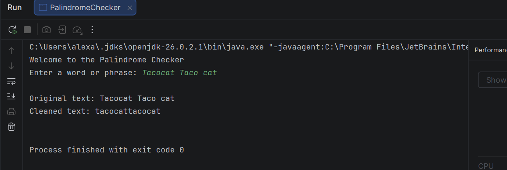
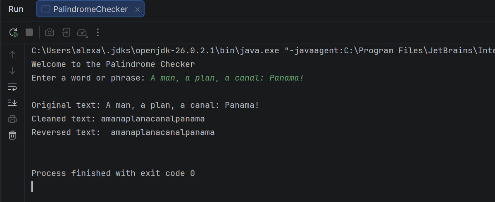
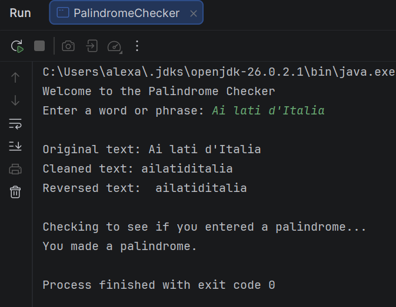
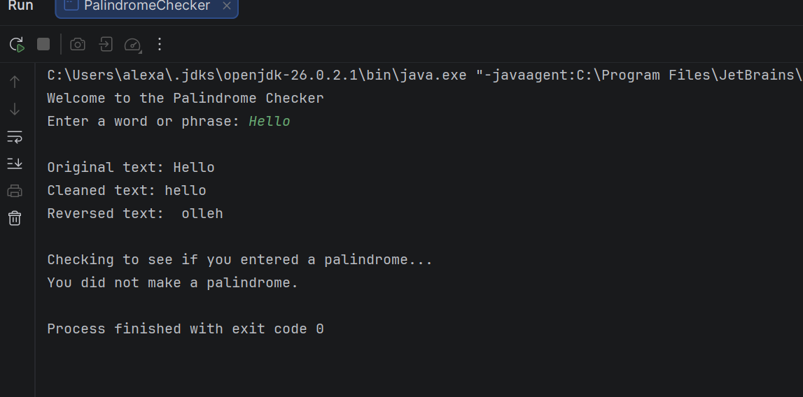

# Palindrome Checker

## Project Description
Palindrome Checker for Java course that cleans the text by removing spaces (intentional or not), punctuation, and formats in lower case. Then, reverses the text and checks if/not a palindrome, and replies with confirmation/denial.

## How to Run
1. Open the Palindrome Checker in IntelliJ
2. Open `src/PalindromeChecker.java`.
3. Run `PalindromeChecker.java`
4. Enter a word or phrase, you can include spaces and punctuation (the program will clean these).
5. After the text is cleaned and reversed, you will be told whether or not the words/phrase you entered is a palindrome or not.

## Screenshots

### Cleaned Text

### Cleaned & Reversed Text

### Palindrome

### Non-Palindrome

